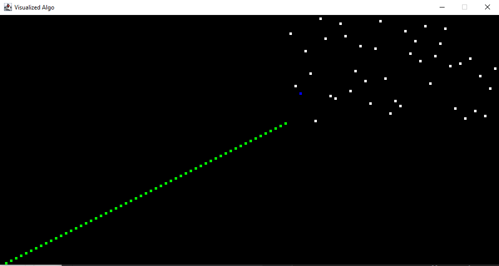

# JAVA Visualized Algo

---

### Description

To provide a visualized image of sorting algorithm. The application are developed by using JAVA with JFrame and Thread handling.

---

### Demo

---

### Pending

- Selection Sort (Done)
- Bubble Sort (Done)
- Insertion Sort
- Merge Sort
- More and more...
